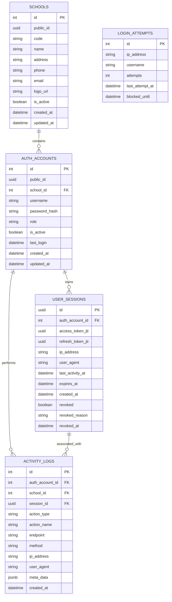
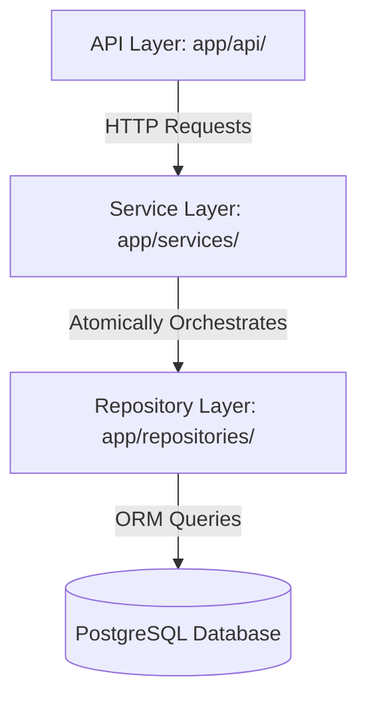
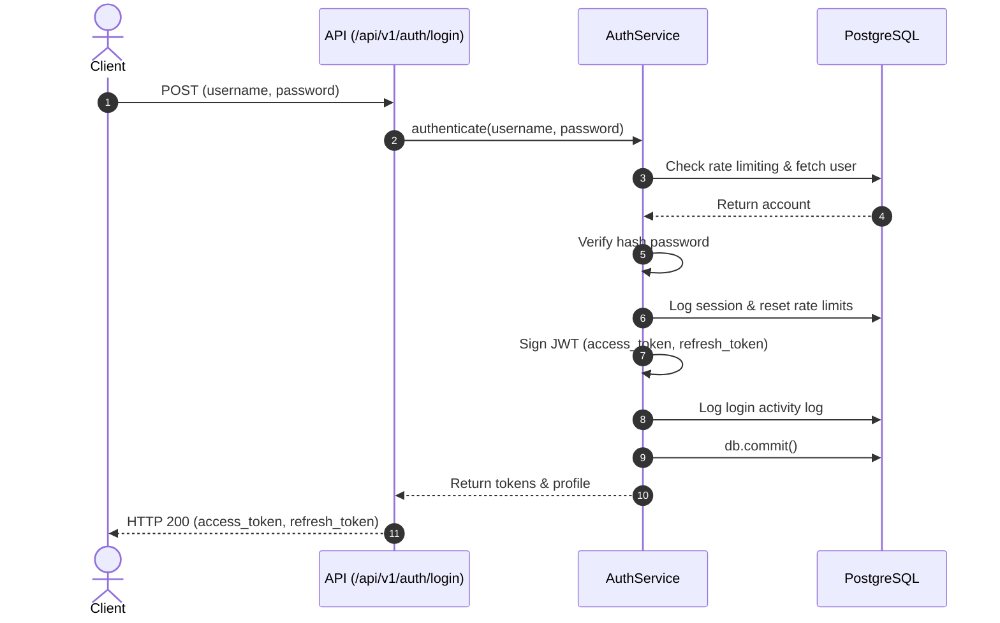
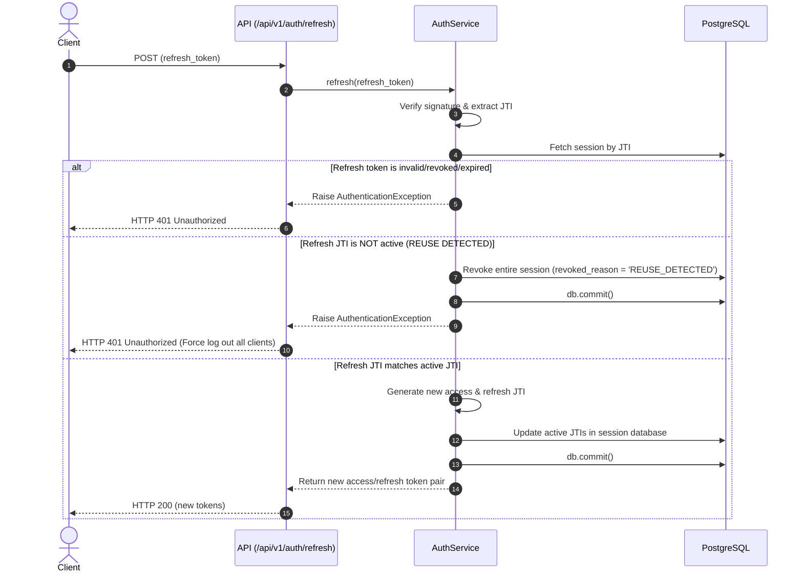
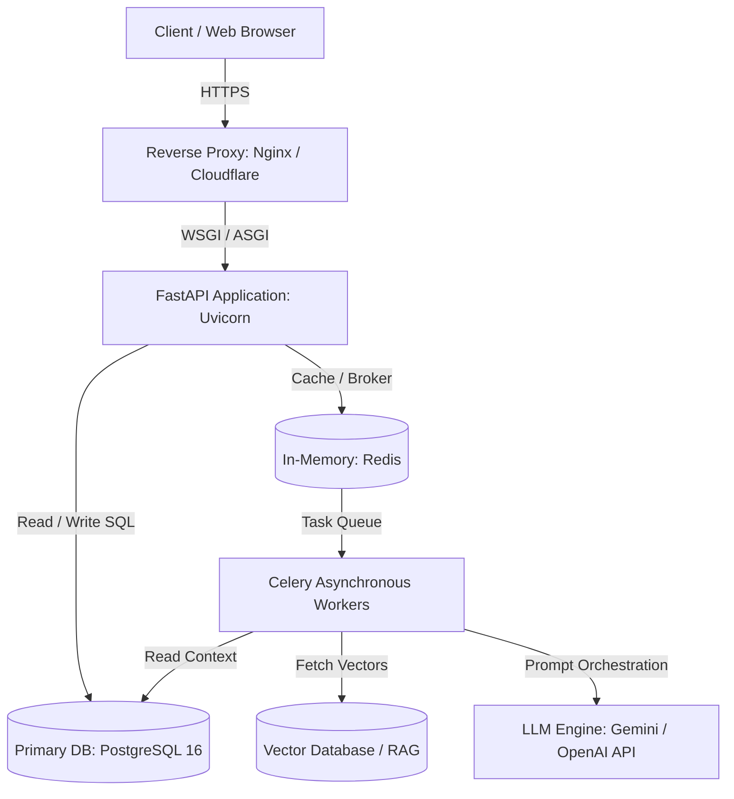
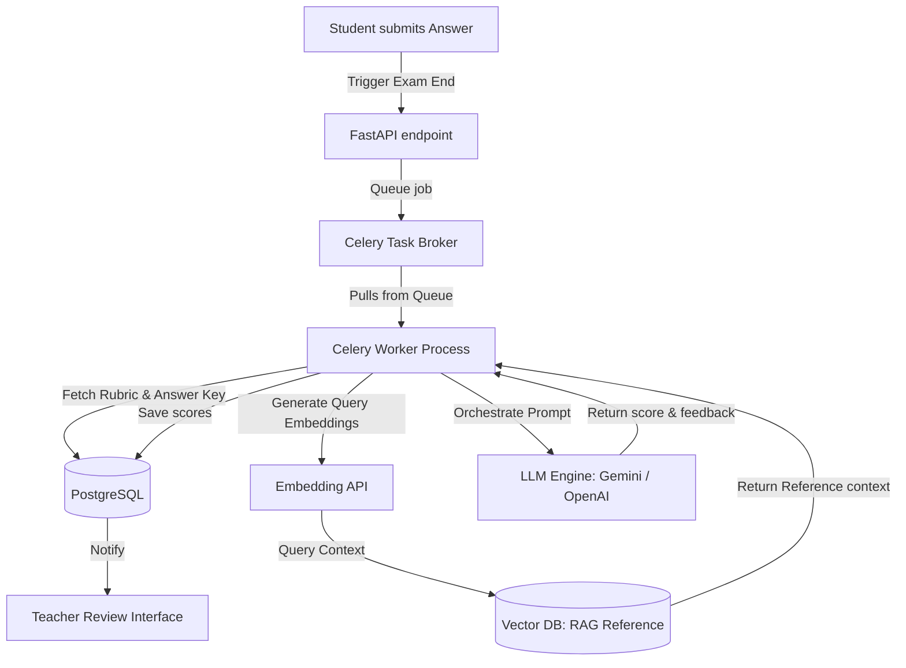
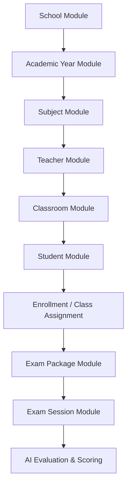

# EquiGrade Technical Design Document (TDD)

## 1. System Overview
EquiGrade is a production-grade Educational Platform designed to facilitate school management, exam scheduling, exam delivery, and automated essay evaluations using Artificial Intelligence (AI) and Retrieval-Augmented Generation (RAG).

This document serves as the primary technical specification for EquiGrade's core infrastructure, security architecture, and developer pipeline.

---

## 2. Technology Stack
* **Language**: Python 3.12+
* **Framework**: FastAPI (Asynchronous Web Framework)
* **Database ORM**: SQLAlchemy 2.0 (Transactional DB connection & mapping)
* **Migrations**: Alembic
* **Database**: PostgreSQL 16
* **Task Queue**: Celery (for asynchronous heavy workloads like AI Evaluation)
* **Caching & Broker**: Redis
* **Linting & Formatting**: Black, Ruff, Mypy
* **Testing**: Pytest, Pytest-Cov, Faker

---

## 3. Core Directory Structure
```text
app/
├── api/                  # API Layer (routers & versioned endpoints)
│   └── v1/               # Version 1 routers (auth, health, etc.)
├── core/                 # Shared configs, database connection, dependencies
├── exceptions/           # Global Exception classes & handlers
├── logging/              # Structured logger setup
├── middleware/           # HTTP Request interceptors (latency, Request ID)
├── models/               # SQLAlchemy ORM models
├── repositories/         # Database query wrappers (Repository Pattern)
├── schemas/              # Pydantic data serialization & validation schemas
├── services/             # Business Logic & transaction orchestrations
└── utils/                # Helper tools (date formatting, uuid helpers)
docs/
├── adr/                  # Architecture Decision Records
└── TDD.md                # Technical Design Document
tests/                    # Test cases (conftest, unit, and integration tests)
```

---

## 4. Database Structure
EquiGrade uses PostgreSQL. The Entity-Relationship Diagram (ERD) below details the tables defined in the Security Foundation:



---

## 5. Architectural Pattern: Clean Architecture & Repository Pattern
EquiGrade separates concerns using a layered architecture:



### 5.1 Repository Pattern Rules
* **BaseRepository**: A generic class `BaseRepository[ModelType]` provides standard database operations (create, read, update, delete, exists, soft_delete, count, pagination) using SQLAlchemy 2.0 select statement scalars.
* **No Inline Commits**: Repositories are strictly prohibited from calling `db.commit()` or `db.rollback()`. They stage database state using `db.add()`, `db.flush()`, or `db.delete()`.
* **Atomic Transactions**: The Service layer is responsible for invoking `db.commit()` inside a `try...except` block, rolling back in case of exceptions. This allows multiple repositories to execute operations under a single ACID transaction.

---

## 6. Authentication & Session Flow
EquiGrade enforces stateless JWT delivery paired with stateful database verification.

### 6.1 Authentication (Login) Sequence


### 6.2 Refresh Token Rotation (RTR) & Replay Attack Protection
To prevent refresh token theft, every token refresh triggers rotation. If an old refresh token is reused, the entire session is instantly terminated:



---

## 7. Security Design (Non-functional Security Requirements)
1. **Password Complexity Policy**: Minimum 8 characters, requiring at least one lowercase letter, one uppercase letter, one digit, and one special symbol. Checked via regex before hashing using `bcrypt`.
2. **Brute Force Lockout**: 5 failed login attempts for a specific `(ip_address, username)` combination locks the account from further attempts for 15 minutes.
3. **Session Idle Timeout**: Sessions expire after 120 minutes of inactivity. The `get_current_user` dependency updates `last_activity_at` and revokes the session if the elapsed time exceeds the idle threshold.
4. **JWT Key Rotation**: Secret keys are selected dynamically using Key ID (`kid`) in the JWT header, allowing secrets to be rotated in production without invalidating active sessions.
5. **Token Versioning**: Tokens include a version claim (`"ver": 1`). If the token version does not match the active server token version, the request is rejected.

---

## 8. Development Pipeline & DevEx (Phase 0.5)
1. **Quality Gates**: Ruff (linting), Black (formatting), and Mypy (strict type-checking) are configured in `pyproject.toml`.
2. **Git Pre-commit hooks**: Enforces formatting, linting, and type checking locally before every commit.
3. **CI Pipeline (GitHub Actions)**: Builds a PostgreSQL service container, installs dependencies, checks syntax (Black & Ruff), runs static analysis (Mypy), and executes tests.
4. **Pytest Coverage**: Measures test suite coverage. Current coverage stands at **80%** with all 21 unit & integration tests passing.

---

## 9. Deployment & Runtime Architecture
The following flowchart illustrates the physical and runtime deployment architecture for EquiGrade:



---

## 10. AI Evaluation & RAG Pipeline (Future)
For automated essay evaluation, the system decouples heavy computation into an asynchronous AI Pipeline:



---

## 11. LockExam Integration
To support secure high-stakes examinations, EquiGrade integrates with the **LockExam** subsystem:
* **Secure Exam Mode**: Restricts browser navigation, blocks copy-paste commands, prevents tab switching, and detects unauthorized shortcut keys.
* **Heartbeat Protocol**: Continuous ping-pong connection between client-side exam shell and server. Session automatically flags suspension if three consecutive heartbeats are missed.
* **Device Binding**: Locks an active exam session to a unique hardware fingerprint. Prevents students from resuming a quiz on a different device without supervisor authentication.
* **Focus Monitoring**: Logs window-blur events (e.g. when browser loses focus) and records infractions directly in the database.
* **Offline Detection & Sync**: Temporarily caches responses in local storage during network interruptions and synchronizes updates with the server upon reconnection.

---

## 12. Business Modules & Implementation Dependency
To guide Phase 1 and subsequent sprints, the educational modules must be built according to the following dependency hierarchy:



---

## 13. Non-Functional Requirements (NFR)
The target service level indicators (SLIs) for the initial release are specified below:

| Requirement | Target Metric | Verification Method |
| :--- | :--- | :--- |
| **Availability** | 99.5% uptime monthly | Health probe endpoint `/api/v1/health` |
| **Login Response** | < 300 ms (latency under normal load) | Middleware latency logging |
| **Refresh Token Response** | < 200 ms | Middleware latency logging |
| **AI Evaluation Processing** | Asynchronous execution (No blocking) | Celery task scheduler |
| **Max Concurrent Users** | 500 active concurrent connections | Locust load testing suite |
| **Security Standards** | OWASP Top 10 Compliance | Static analysis and manual audits |

---

## 14. Appendices

### Appendix A: Naming Conventions
To maintain strict project style coherence, the following conventions are enforced:

| Object Type | Case Convention | Example |
| :--- | :--- | :--- |
| **PostgreSQL Table** | `snake_case` | `user_sessions`, `login_attempts` |
| **PostgreSQL Column** | `snake_case` | `auth_account_id`, `is_active` |
| **Python Class** | `PascalCase` | `AuthService`, `BaseRepository` |
| **Variables & Functions** | `snake_case` | `session_id`, `get_current_user` |
| **Constants** | `UPPER_CASE` | `ACCESS_TOKEN_EXPIRE_MINUTES`, `ALGORITHM` |

### Appendix B: Architecture Rules & Clean Code Summary
Every developer committing to EquiGrade must adhere to these frozen guidelines:
1. **Separation of Database Queries**: API Routers are prohibited from invoking SQLAlchemy sessions. All data retrieval and storage operations must go through repositories.
2. **Transaction Boundaries**: Repositories are prohibited from committing changes (`db.commit()` or `db.rollback()`). All writes must be staged (`db.add()`) and committed atomically inside services.
3. **HTTP Decoupling**: Service classes must not import `fastapi.HTTPException` or reference HTTP details. Services raise business exceptions (defined under `app/exceptions/`), which are translated by global handlers.
4. **Action Audits**: All state-modifying actions (insert, update, delete) must record an entry in the `activity_logs` table.
5. **Testing Enforcement**: Every new router endpoint, repository query, or business logic flow must have corresponding unit or integration test cases written under `tests/`.
