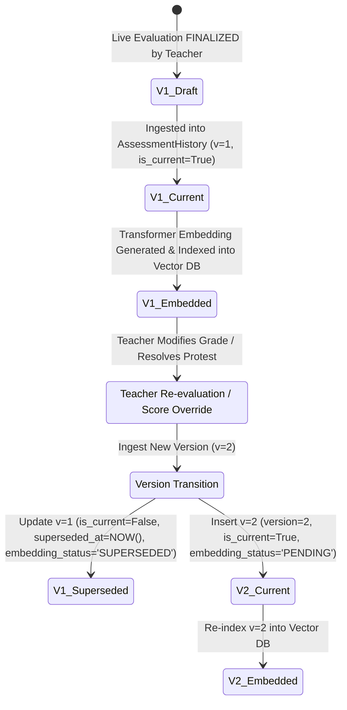
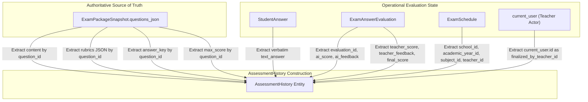

# 📋 EQUIGRADE x LOCKXAM — MILESTONE A0.1
# ASSESSMENT HISTORY SCHEMA AMENDMENT REPORT

**Date:** September 1, 2026
**Auditor:** Senior AI & Systems Architect (Antigravity Agent)
**Status:** 🟢 AMENDMENT COMPLETE (Audit & Specification Phase — Zero Code Modifications Made)
**Baseline:** `assessment_history_schema_audit.md` (Approved with Amendments)
**Scope Lock:** Core System Frozen (`auth`, `cbt_engine`, `import_validation`, `exam_snapshot`, `super_admin`)

---

## 1. Executive Summary of Amendments (Changes from A0 to A0.1)

| Area | Initial Proposal (A0) | Required Amendment (A0.1) | Architectural Rationale |
| :--- | :--- | :--- | :--- |
| **1. Ingestion Strategy** | Upsert / in-place overwrite of `existing_history` | **Strict Append-Only Versioning** | Historical knowledge must never be overwritten. Every teacher re-evaluation creates an immutable version snapshot. |
| **2. Unique Constraint** | `UNIQUE (evaluation_id)` | **`UNIQUE (evaluation_id, version)`** | Enables co-existence of historical versions ($v_1, v_2, \dots$) with explicit `is_current` and `superseded_at` state. |
| **3. Foreign Key Deletion** | `ON DELETE CASCADE` | **`ON DELETE RESTRICT`** | Operational deletions of exam attempts or evaluations must never delete authoritative historical training datasets. |
| **4. Subject Identity** | `subject_name` (String label) | **`subject_id` (FK Integer) + `subject_name`** | Multi-tenant isolation and indexing relies on authoritative relational ID (`subject_id`), while keeping `subject_name` for frozen semantic context. |
| **5. Question Content Source** | Referenced `questions` table | **Strictly `ExamPackageSnapshot.questions_json`** | Mutable question bank table is never read for history. Content, rubrics, and keys originate 100% from frozen snapshot. |
| **6. Teacher Identity** | Single `teacher_id` from schedule | **`exam_teacher_id` + `finalized_by_teacher_id`** | Differentiates the author/assigned teacher from the actual teacher actor who validated/finalized the grade. |
| **7. AI Provenance** | Basic model name string | **Structured AI Lineage Metadata** | Captures `ai_model_name`, `ai_prompt_version`, `ai_rubric_version`, and `ai_evaluated_at` for rigorous AI research and error-analysis. |
| **8. RAG Ingestion Filter** | `is_rag_eligible == TRUE` | **`is_rag_eligible == TRUE AND is_current == TRUE`** | RAG retrieval strictly excludes superseded assessment versions. |

---

## 2. Revised Database Schema: `assessment_histories`

```sql
CREATE TABLE assessment_histories (
    id BIGSERIAL PRIMARY KEY,
    public_id VARCHAR(36) NOT NULL UNIQUE,

    -- 1. Multi-Tenant & Academic Isolation (Authoritative IDs + Display Context)
    school_id INTEGER NOT NULL REFERENCES schools(id) ON DELETE RESTRICT,
    academic_year_id INTEGER NOT NULL REFERENCES academic_years(id) ON DELETE RESTRICT,
    subject_id INTEGER NOT NULL REFERENCES subjects(id) ON DELETE RESTRICT,
    subject_name VARCHAR(255) NOT NULL,
    class_level VARCHAR(50) NOT NULL,

    -- 2. Lineage Tracking & Evaluator Actors
    evaluation_id INTEGER NOT NULL REFERENCES exam_answer_evaluations(id) ON DELETE RESTRICT,
    exam_attempt_id INTEGER NOT NULL REFERENCES exam_attempts(id) ON DELETE RESTRICT,
    question_id INTEGER NOT NULL REFERENCES questions(id) ON DELETE RESTRICT,
    exam_teacher_id INTEGER NOT NULL REFERENCES auth_accounts(id) ON DELETE RESTRICT,
    finalized_by_teacher_id INTEGER NOT NULL REFERENCES auth_accounts(id) ON DELETE RESTRICT,

    -- 3. Versioning & Immutability Lifecycle
    version INTEGER NOT NULL DEFAULT 1,
    is_current BOOLEAN NOT NULL DEFAULT TRUE,
    superseded_at TIMESTAMP WITH TIME ZONE NULL,

    -- 4. Frozen Assessment Context (Strictly from ExamPackageSnapshot.questions_json)
    question_text TEXT NOT NULL,
    question_type VARCHAR(50) NOT NULL DEFAULT 'ES',
    answer_key TEXT NOT NULL,
    rubrics_json JSON NOT NULL,
    max_score NUMERIC(5, 2) NOT NULL,

    -- 5. Student Submission (Verbatim, PII Excluded)
    student_answer TEXT NOT NULL,

    -- 6. AI Assessment Provenance & Draft Data
    ai_score NUMERIC(5, 2) NULL,
    ai_feedback TEXT NULL,
    ai_model_name VARCHAR(100) NULL,
    ai_prompt_version VARCHAR(50) NULL,
    ai_rubric_version INTEGER NOT NULL DEFAULT 1,
    ai_evaluated_at TIMESTAMP WITH TIME ZONE NULL,

    -- 7. Teacher Ground Truth & Correction Validation
    teacher_score NUMERIC(5, 2) NOT NULL,
    teacher_feedback TEXT NULL,
    final_score NUMERIC(5, 2) NOT NULL,
    score_delta NUMERIC(5, 2) NOT NULL DEFAULT 0.0,

    -- 8. RAG & Transformer Embedding State
    is_rag_eligible BOOLEAN NOT NULL DEFAULT TRUE,
    embedding_status VARCHAR(50) NOT NULL DEFAULT 'PENDING',  -- PENDING, EMBEDDED, FAILED, SUPERSEDED
    embedded_at TIMESTAMP WITH TIME ZONE NULL,
    vector_id VARCHAR(100) NULL,

    -- 9. Audit Timestamps
    created_at TIMESTAMP WITH TIME ZONE NOT NULL DEFAULT NOW(),
    updated_at TIMESTAMP WITH TIME ZONE NOT NULL DEFAULT NOW(),

    -- 10. Integrity Constraints
    CONSTRAINT uq_assessment_history_eval_version UNIQUE (evaluation_id, version)
);
```

---

## 3. Revised Indexes

```sql
-- Index 1: Primary Tenant & Subject Isolation Querying
CREATE INDEX ix_ah_tenant_subject ON assessment_histories (school_id, subject_id, class_level);

-- Index 2: Active RAG Ingestion & Vector Ingestion Queue
CREATE INDEX ix_ah_rag_active_queue ON assessment_histories (school_id, embedding_status)
WHERE is_rag_eligible = TRUE AND is_current = TRUE;

-- Index 3: Question Lineage & Teacher Audit Lookup
CREATE INDEX ix_ah_lineage_lookup ON assessment_histories (school_id, question_id, is_current);

-- Index 4: Evaluation History Version Chain
CREATE INDEX ix_ah_eval_version_chain ON assessment_histories (evaluation_id, version);
```

---

## 4. Append-Only Versioning & Lifecycle State Machine



### Business Invariants for Versioning:
1. **Never Overwrite (`UPDATE` forbidden on payload):** Fields like `question_text`, `student_answer`, `ai_score`, `teacher_score`, and `teacher_feedback` are **immutable** once inserted.
2. **Current Record Exclusivity:** For any given `evaluation_id`, exactly one record will have `is_current = TRUE`.
3. **Vector Invalidation:** When a record transitions to `is_current = FALSE`, its vector representation in the Vector DB is marked inactive/deleted, and the new version $v+1$ is queued for embedding.

---

## 5. Foreign Key & Delete Safety Rationale

| Referenced Table | FK Column in `assessment_histories` | Delete Action | Justification |
| :--- | :--- | :--- | :--- |
| `schools` | `school_id` | **`RESTRICT`** | A school with active historical academic data cannot be dropped abruptly without explicit data retention migration. |
| `academic_years` | `academic_year_id` | **`RESTRICT`** | Academic period context must be preserved for historical records. |
| `subjects` | `subject_id` | **`RESTRICT`** | Subject taxonomy cannot be deleted if historical student assessment knowledge exists under it. |
| `exam_answer_evaluations` | `evaluation_id` | **`RESTRICT`** | Prevents accidental deletion of live evaluation records while they anchor historical knowledge. |
| `exam_attempts` | `exam_attempt_id` | **`RESTRICT`** | Protects student exam attempt lineage. |
| `questions` | `question_id` | **`RESTRICT`** | Retains lineage to master question bank entity without depending on its content. |
| `auth_accounts` | `exam_teacher_id` | **`RESTRICT`** | Teacher audit trail preservation. |
| `auth_accounts` | `finalized_by_teacher_id` | **`RESTRICT`** | Finalizing actor accountability. |

---

## 6. Snapshot Data Lineage & Extraction Pipeline



### Strict Content Loading Rule:
```python
# PROHIBITED (Mutable drift risk):
# question = db.query(Question).filter_by(id=eval_item.question_id).first()
# q_text = question.content  <-- NEVER DO THIS

# ENFORCED (Immutable snapshot lineage):
snapshot = snapshot_repository.get_by_session(db, attempt.exam_session_id)
q_data = next((q for q in snapshot.questions_json if (q.get("id") or q.get("question_id")) == eval_item.question_id), None)
q_text = q_data["content"]
q_key = q_data["answer_key"]
q_rubrics = q_data["rubrics"]
```

---

## 7. AI Provenance Lineage

Provenance parameters are extracted from the runtime evaluation environment:
- **`ai_model_name`:** Sourced from `AiGradingService` config (e.g. `llama-3.3-70b-versatile` / `equigradeAI-v3`).
- **`ai_prompt_version`:** Sourced from system prompt release identifier (e.g. `equigrade-rubric-v2.1`).
- **`ai_rubric_version`:** Sourced from `snapshot.snapshot_version` (integer).
- **`ai_evaluated_at`:** Sourced from `ExamAnswerEvaluation.last_evaluated_at` before teacher finalization.

---

## 8. RAG Ingestion Document Formatting (PII-Clean)

When `AssessmentHistory` records are serialized into text chunks for the `intfloat/multilingual-e5-large` Transformer model, the following standardized template is generated:

```text
passage:
[Mata Pelajaran]: {subject_name}
[Jenjang Kelas]: {class_level}
[Pertanyaan / Soal]: {question_text}
[Kunci Jawaban / Konsep Kunci]: {answer_key}
[Rubrik Penilaian]:
{rubrics_formatted_text}
[Jawaban Siswa]:
{student_answer}
[Evaluasi & Koreksi Guru]:
{teacher_feedback}
[Skor Guru]: {teacher_score} / {max_score}
```

### Privacy Guarantee:
- **Zero Student PII:** Names, usernames, NIS, NISN, IP addresses, and device fingerprints are completely excluded from the embedding text and vector metadata.

---

## 9. Next Steps: Roadmap to Milestone A1

1. **A0.1 Final Sign-off:** Confirm this amendment report satisfies all architectural constraints.
2. **Milestone A1 Execution (Upon User Approval):**
   - Create `app/models/ai/assessment_history.py` implementing the amended schema.
   - Create Alembic migration script `migrations/versions/0002_create_assessment_histories.py`.
   - Implement `app/repositories/ai/assessment_history_repository.py`.
   - Hook history creation into `ExamService.finalize_evaluation()`.
   - Write automated unit and integration tests in `tests/test_assessment_history.py`.

---

**Milestone A0.1 Schema Amendment Specification Complete.** Ready for authorization to begin Milestone A1 implementation.
