# 📋 EQUIGRADE x LOCKXAM — MILESTONE A0
# ASSESSMENT HISTORY SCHEMA & DATA LINEAGE AUDIT REPORT

**Date:** September 1, 2026
**Auditor:** Senior AI & Systems Architect (Antigravity Agent)
**Status:** 🟢 COMPLETED (Audit Phase — Zero Code Modifications Made)
**Scope Lock:** Core System Frozen (`auth`, `cbt_engine`, `import_validation`, `exam_snapshot`, `super_admin`)

---

## 1. Existing Assessment Domain Map

| Entity / Model | DB Table | Primary Key | Foreign Keys | Key Fields | Lifecycle / Mutability | Creating / Updating Service | Creating / Updating API | Overlap with Assessment History |
| :--- | :--- | :--- | :--- | :--- | :--- | :--- | :--- | :--- |
| **`Question`** | `questions` | `id` (int) | `owner_teacher_account_id` $\to$ `auth_accounts.id` | `type` (PG/IS/ES), `content`, `options` (JSON), `answer_key`, `rubrics` (JSON), `subject`, `class_level`, `ai_grading` (bool) | **Mutable** (Teacher can edit/delete at any time in Question Bank) | `QuestionService` | `/api/v1/teacher/questions` | Contains master question text, answer key, and rubric criteria. Cannot be used directly for historical evaluation because it is mutable. |
| **`QuestionPackage`** | `question_packages` | `id` (int) | `owner_teacher_account_id`, `school_id` | `name`, `class_level`, `target_counts` (JSON), `status` (DRAFT/READY) | **Mutable until assigned** | `QuestionPackageService` | `/api/v1/teacher/question-packages` | Aggregation metadata for question sets. |
| **`QuestionPackageItem`** | `question_package_items` | `id` (int) | `package_id` $\to$ `question_packages.id`, `question_id` $\to$ `questions.id` | `sort_order`, `points` | **Mutable** | `QuestionPackageService` | `/api/v1/teacher/question-packages/{id}/items` | Points and ordering per question. |
| **`ExamSchedule`** | `exam_schedules` | `id` (int) | `school_id`, `academic_year_id`, `academic_semester_id`, `class_id`, `subject_id`, `teacher_id`, `proctor_id`, `package_id` | `title`, `start_time`, `end_time`, `duration_minutes`, `status`, `lock_browser`, `eyd_language_evaluation` | **State-driven** (`DRAFT` $\to$ `PUBLISHED` $\to$ `ACTIVE` $\to$ `COMPLETED`) | `ExamScheduleService` | `/api/v1/academic/schedules` | Multi-tenant academic context (School, Year, Class, Subject, Teacher). |
| **`ExamSnapshot` / `ExamPackageSnapshot`** | `exam_snapshots` / `exam_package_snapshots` | `id` (int) | `exam_schedule_id` $\to$ `exam_schedules.id`, `exam_session_id` $\to$ `exam_sessions.id` | `source_package_id`, `school_id`, `owner_teacher_account_id`, `questions_json` (JSON), `snapshot_version`, `is_locked` | **IMMUTABLE** (Deep-cloned JSON of questions, answer keys, points, and rubrics created at schedule activation) | `ExamSnapshotService` | Triggered at session activation | **Core authoritative source for immutable question content, rubrics, and answer keys as presented to student.** |
| **`ExamSession`** | `exam_sessions` | `id` (int) | `schedule_id` $\to$ `exam_schedules.id` | `session_code`, `status` (`SCHEDULED`, `ACTIVE`, `COMPLETED`), `created_at` | State-driven | `ExamSessionService` | `/api/v1/exam/sessions` | Operational runtime boundary for CBT exam. |
| **`ExamAttempt`** | `exam_attempts` | `id` (int) | `exam_session_id` $\to$ `exam_sessions.id`, `student_id` | `status` (`NOT_STARTED` $\to$ `IN_PROGRESS` $\to$ `SUBMITTED` $\to$ `GRADING` $\to$ `GRADED`), `randomized_order`, `started_at`, `deadline_at`, `final_score` | State-driven lifecycle | `ExamService` | `/api/v1/exam/attempts` | Student's test instance and aggregated final score. |
| **`StudentAnswer`** | `student_answers` | `id` (int) | `exam_attempt_id` $\to$ `exam_attempts.id` | `question_id`, `selected_option`, `text_answer`, `last_updated_at` | **Mutable during test $\to$ Frozen upon submit** | `ExamService.autosave_answer` | `/api/v1/exam/autosave` | Exact verbatim answer text submitted by the student. |
| **`ExamAnswerEvaluation`** | `exam_answer_evaluations` | `id` (int) | `exam_attempt_id` $\to$ `exam_attempts.id` | `question_id`, `score`, `max_score`, `grading_status` (`AI_PENDING`, `AI_DRAFT`, `AUTO_GRADED`, `FINALIZED`), `grading_source` (`SYSTEM`, `AI`, `TEACHER`), `grading_version`, `feedback`, `last_evaluated_at` | **Live grading state** (Transitions from AI draft to teacher finalization) | `ExamService`, `AiGradingService`, `TeacherGrading` | `/api/v1/exam/ai/callback`, `/api/v1/teacher/grading/evaluations/{id}/finalize` | Current grading state. When `grading_status == FINALIZED` and `grading_source == TEACHER`, this becomes the trigger for Assessment History. |
| **`AiGradingEventLog`** | `ai_grading_event_logs` | `id` (int) | `attempt_id` $\to$ `exam_attempts.id` | `event_id` (UUID), `grading_version`, `processed_at` | Append-only idempotency ledger | `ExamService.process_ai_callback` | `/api/v1/exam/ai/callback` | Webhook idempotency ledger for AI callbacks. |

---

## 2. Data Lineage Diagram

```mermaid
flowchart TD
    subgraph Authoring["1. Authoring Domain (Mutable)"]
        Q["Question Bank<br/>(content, answer_key, rubrics JSON)"] --> PKG["Question Package"]
        SCH["Exam Schedule<br/>(School, Subject, Class, Teacher)"]
    end

    subgraph Freezing["2. Snapshot Domain (Immutable)"]
        PKG --> SNAP["ExamPackageSnapshot<br/>(questions_json: frozen copy of Q, rubrics, answer_key)"]
        SCH --> SESS["Exam Session"]
        SNAP --> SESS
    end

    subgraph Execution["3. Execution & Submission"]
        SESS --> ATT["Exam Attempt<br/>(student_id, status: GRADING)"]
        ATT --> ANS["Student Answer<br/>(text_answer, frozen upon submit)"]
    end

    subgraph LiveGrading["4. Live Evaluation State Machine"]
        ANS --> EVAL["ExamAnswerEvaluation<br/>(AI_PENDING)"]
        EVAL -->|Background AI / Microservice| AI_EVAL["ExamAnswerEvaluation<br/>(status: AI_DRAFT, source: AI,<br/>score: AI_Score, feedback: AI_Feedback)"]
        AI_EVAL -->|Teacher Review / Override| T_EVAL["ExamAnswerEvaluation<br/>(status: FINALIZED, source: TEACHER,<br/>score: Final_Score, feedback: Teacher_Feedback)"]
    end

    subgraph TrustBoundary["5. RAG Trust Boundary & Archival"]
        T_EVAL -->|Finalize Event Trigger| HIST["AssessmentHistory<br/>(Authoritative, Teacher-Validated Knowledge)"]
        HIST --> EMB["Transformer Embedding Pipeline<br/>(intfloat/multilingual-e5-large)"]
        EMB --> VEC["Vector Store / RAG Knowledge Base"]
    end

    style SNAP fill:#1e293b,stroke:#38bdf8,stroke-width:2px
    style ANS fill:#1e293b,stroke:#38bdf8,stroke-width:2px
    style T_EVAL fill:#064e3b,stroke:#10b981,stroke-width:2px
    style HIST fill:#312e81,stroke:#6366f1,stroke-width:3px
    style VEC fill:#4c1d95,stroke:#a855f7,stroke-width:2px
```



---

## 3. Existing Evaluation Lifecycle

The lifecycle of an evaluation in `ExamAnswerEvaluation` follows a deterministic finite-state transition:

```text
[STUDENT SUBMIT]
       │
       ▼
   Question Type?
   ├── PG / IS ───► status: AUTO_GRADED ───► source: SYSTEM  (Instant exact-match)
   │
   └── ES (Essay) ─► status: AI_PENDING  ───► source: SYSTEM  (Enqueued for AI)
                            │
                            ▼ (AiGradingService / equigradeAI)
                     status: AI_DRAFT    ───► source: AI      (Score: AI_Score, Feedback: AI_Feedback)
                            │
                            ▼ (Teacher Reviews & Edits in TeacherGradingView)
                     status: FINALIZED   ───► source: TEACHER (Score: Teacher_Score, Feedback: Teacher_Notes)
```

### Key Architectural Finding:
- **`AI_DRAFT` is speculative and provisional:** AI score is an initial suggestion generated by LLM/Rubric analysis. It has **NOT** passed teacher pedagogical validation.
- **`FINALIZED` is authoritative:** The teacher has either approved or corrected the score and feedback. Only records at `status: FINALIZED` with `source: TEACHER` (or explicit teacher confirmation) cross the **RAG Trust Boundary**.

---

## 4. Assessment History Requirements & Data Composition

To serve as a high-fidelity Case-Based Reasoning (CBR) / RAG knowledge source, each `AssessmentHistory` record must contain the complete context required for semantic retrieval without depending on mutable relational joins.

### Complete Data Composition Matrix:

| Category | Field Name | Source Entity | Origin Description |
| :--- | :--- | :--- | :--- |
| **Identity & Audit** | `id` | `AssessmentHistory` | Primary Key (BigInteger / UUID) |
| | `evaluation_id` | `ExamAnswerEvaluation.id` | Foreign Key to origin evaluation |
| | `attempt_id` | `ExamAttempt.id` | Source attempt reference |
| | `question_id` | `Question.id` | Master question ID |
| **Multi-Tenant Isolation** | `school_id` | `ExamPackageSnapshot.school_id` | Tenant isolation key |
| | `academic_year_id` | `ExamSchedule.academic_year_id` | Academic period context |
| | `subject_name` | `ExamSchedule.subject.name` | Subject taxonomy |
| | `class_level` | `Question.class_level` / `ClassEntity.name` | Grade level (e.g. "X", "XI", "XII") |
| **Frozen Question Context** | `question_text` | `ExamPackageSnapshot.questions_json[i].content` | Frozen question prompt |
| | `question_type` | `ExamPackageSnapshot.questions_json[i].type` | "ES" (Essay) |
| | `answer_key` | `ExamPackageSnapshot.questions_json[i].answer_key` | Official expected answer / concepts |
| | `rubric_criteria` | `ExamPackageSnapshot.questions_json[i].rubrics` | Structured rubric criteria (JSON) |
| | `max_score` | `ExamAnswerEvaluation.max_score` | Maximum points allocated |
| **Student Submission** | `student_answer` | `StudentAnswer.text_answer` | Verbatim text written by student |
| **AI Assessment Draft** | `ai_score` | `ExamAnswerEvaluation` (prior state) | Initial AI predicted score |
| | `ai_feedback` | `ExamAnswerEvaluation` (prior state) | Initial AI rationale |
| | `ai_model_name` | Environment / AI config | e.g. `llama-3.3-70b-versatile` |
| **Teacher Validation** | `final_score` | `ExamAnswerEvaluation.score` | Final score assigned by teacher |
| | `teacher_feedback` | `ExamAnswerEvaluation.feedback` | Final feedback / corrective guidance |
| | `score_delta` | Computed (`final_score - ai_score`) | Discrepancy metric ($0.0$ if accepted) |
| | `teacher_id` | `ExamSchedule.teacher_id` | Evaluator teacher account ID |
| | `evaluated_at` | `ExamAnswerEvaluation.last_evaluated_at` | Timestamp of teacher finalization |
| **RAG Metadata** | `embedding_status` | Enum (`PENDING`, `EMBEDDED`, `FAILED`)| Pipeline tracking status |
| | `embedding_id` | String / Vector reference | Vector DB point ID / hash |

---

## 5. RAG Trust Boundary & Eligibility Rule

```text
       ┌──────────────────────────────────────────────┐
       │             LIVE EVALUATION STATE            │
       │  (AI_PENDING / AI_DRAFT / AUTO_GRADED)       │
       └──────────────────────┬───────────────────────┘
                              │
                    [Teacher Finalization]
                              │
                              ▼
       ╔══════════════════════════════════════════════╗
       ║             RAG TRUST BOUNDARY               ║
       ║  Condition:                                  ║
       ║  1. grading_status == FINALIZED              ║
       ║  2. grading_source == TEACHER                ║
       ║  3. question_type == 'ES'                    ║
       ║  4. student_answer.strip() != ""             ║
       ╚══════════════════════════════════════════════╝
                              │
                              ▼
       ┌──────────────────────────────────────────────┐
       │             ASSESSMENT HISTORY               │
       │  (Authoritative Teacher-Validated Dataset)   │
       └──────────────────────┬───────────────────────┘
                              │
                              ▼
       ┌──────────────────────────────────────────────┐
       │        TRANSFORMER EMBEDDING & RAG           │
       │       (intfloat/multilingual-e5-large)       │
       └──────────────────────────────────────────────┘
```

> [!IMPORTANT]
> **Zero Untrusted Ingestion Rule:** An AI draft score **NEVER** enters the RAG vector index directly. Only after a teacher clicks *"Simpan & Kunci Seluruh Nilai Siswa"* or finalizes an evaluation does the snapshot get written to `AssessmentHistory` and marked as `RAG_ELIGIBLE`.

---

## 6. Immutability & Snapshot Integrity

1. **Decoupling from Mutable Question Bank:**
   - If a teacher modifies a question text or alters rubric points in `Bank Soal` next semester, previous student evaluations must remain untouched.
   - `AssessmentHistory` captures question text and rubric definitions directly from the frozen `ExamPackageSnapshot.questions_json`, guaranteeing **100% historical immutability**.
2. **Append-Only Knowledge Archive:**
   - Records in `AssessmentHistory` are immutable. If a grade protest is approved and a score is re-finalized, a new version entry (`version = version + 1`) is appended with a superseding timestamp rather than overwriting historical lineage.

---

## 7. Multi-Tenant Isolation & Security

To strictly prevent cross-school data leakage:
- Every query to `AssessmentHistory` and every vector similarity search **MUST enforce metadata filtering** by:
  ```python
  filter = {
      "school_id": current_user.school_id,
      "subject_name": subject_filter,  # Optional subject narrowing
  }
  ```
- Cross-tenant retrieval is blocked at both the SQLAlchemy ORM layer and the Vector Store metadata filter layer.

---

## 8. Privacy & PII Separation

| Data Element | Needed for Assessment? | Needed for Transformer Embedding / RAG? | Action |
| :--- | :---: | :---: | :--- |
| **Question Text** | YES | **YES** | Embedded as Query Context |
| **Rubric Criteria** | YES | **YES** | Embedded as Scoring Standard |
| **Student Answer** | YES | **YES** | Embedded as Evaluation Target |
| **Teacher Feedback** | YES | **YES** | Embedded as Ground Truth Rationale |
| **Student Name** | NO | **NO** | ❌ **STRICTLY EXCLUDED** (Stripped before embedding) |
| **NISN / NIS** | NO | **NO** | ❌ **STRICTLY EXCLUDED** |
| **Device IP / Fingerprint**| NO | **NO** | ❌ **STRICTLY EXCLUDED** |
| **Student Account ID** | Audit only | **NO** | Retained in DB record for teacher audit; **NOT in embedding text** |

---

## 9. Duplication Analysis: Architectural Approaches

| Criteria | Approach A: Normalized Reference (Join existing tables on query) | Approach B: Fully Denormalized Document (JSON Blob only) | **Approach C: Hybrid Relational Snapshot (RECOMMENDED)** |
| :--- | :--- | :--- | :--- |
| **Historical Integrity** | 🔴 Low (Fails if Question or Class is deleted or modified) | 🟡 Medium (Hard to run SQL aggregations) | 🟢 **Highest** (Structured frozen snapshot) |
| **Query & Filter Speed** | 🔴 Slow (Requires 6-table JOIN across Exam, Snapshot, Attempt, Answer) | 🟡 Medium (JSON path queries) | 🟢 **Fastest** (Indexed scalar columns + JSON rubric) |
| **RAG Text Construction**| 🔴 Requires heavy ORM hydration | 🟢 Easy | 🟢 **Instant** (All fields locally available in 1 row) |
| **Tenant Isolation** | 🟡 Relies on relational chain integrity | 🟢 Filter on top-level JSON field | 🟢 **Strict indexed foreign key (`school_id`)** |
| **Schema Complexity** | 🟢 Minimal tables | 🟡 Unstructured | 🟢 **Clean, single specialized table** |

### 🎯 Recommendation: **Approach C (Hybrid Relational Snapshot)**
Store scalar relational columns (`school_id`, `question_id`, `final_score`, `ai_score`, `subject_name`) for lightning-fast indexed filtering, alongside the frozen `question_text`, `student_answer`, `rubrics_json`, and `teacher_feedback`.

---

## 10. Recommended Schema Design: `assessment_histories`

```sql
CREATE TABLE assessment_histories (
    id SERIAL PRIMARY KEY,
    public_id VARCHAR(36) NOT NULL UNIQUE,

    -- Tenant & Academic Isolation
    school_id INTEGER NOT NULL REFERENCES schools(id) ON DELETE CASCADE,
    academic_year_id INTEGER NOT NULL REFERENCES academic_years(id) ON DELETE RESTRICT,
    subject_name VARCHAR(255) NOT NULL,
    class_level VARCHAR(50) NOT NULL,

    -- Lineage Tracking
    evaluation_id INTEGER NOT NULL REFERENCES exam_answer_evaluations(id) ON DELETE CASCADE,
    exam_attempt_id INTEGER NOT NULL REFERENCES exam_attempts(id) ON DELETE CASCADE,
    question_id INTEGER NOT NULL REFERENCES questions(id) ON DELETE RESTRICT,
    teacher_id INTEGER NOT NULL REFERENCES auth_accounts(id) ON DELETE RESTRICT,

    -- Frozen Assessment Context
    question_text TEXT NOT NULL,
    question_type VARCHAR(50) NOT NULL DEFAULT 'ES',
    answer_key TEXT NOT NULL,
    rubrics_json JSON NOT NULL,
    max_score NUMERIC(5, 2) NOT NULL,

    -- Student Input (Verbatim)
    student_answer TEXT NOT NULL,

    -- Evaluation Outcomes
    ai_score NUMERIC(5, 2) NULL,
    ai_feedback TEXT NULL,
    ai_model_name VARCHAR(100) NULL,

    teacher_score NUMERIC(5, 2) NOT NULL,
    teacher_feedback TEXT NULL,
    final_score NUMERIC(5, 2) NOT NULL,
    score_delta NUMERIC(5, 2) NOT NULL DEFAULT 0.0,

    -- RAG & Embedding State
    is_rag_eligible BOOLEAN NOT NULL DEFAULT TRUE,
    embedding_status VARCHAR(50) NOT NULL DEFAULT 'PENDING',  -- PENDING, EMBEDDED, FAILED
    embedded_at TIMESTAMP WITH TIME ZONE NULL,
    vector_id VARCHAR(100) NULL,

    -- Audit Timestamps
    created_at TIMESTAMP WITH TIME ZONE NOT NULL DEFAULT NOW(),
    updated_at TIMESTAMP WITH TIME ZONE NOT NULL DEFAULT NOW(),

    CONSTRAINT uq_assessment_history_eval UNIQUE (evaluation_id)
);
```

---

## 11. Recommended Indexes

1. **Tenant Filtering Index:**
   ```sql
   CREATE INDEX ix_ah_school_subject ON assessment_histories (school_id, subject_name, class_level);
   ```
2. **RAG Ingestion Queue Index:**
   ```sql
   CREATE INDEX ix_ah_rag_pending ON assessment_histories (school_id, embedding_status) WHERE is_rag_eligible = TRUE;
   ```
3. **Question Lookup Index:**
   ```sql
   CREATE INDEX ix_ah_question_lookup ON assessment_histories (question_id, school_id);
   ```

---

## 12. Idempotency Strategy

- **Unique Constraint on `evaluation_id`:** Since each `ExamAnswerEvaluation` represents a unique student attempt on a question, the database constraint `UNIQUE(evaluation_id)` prevents duplicate historical records.
- **Upsert / Sync Logic:**
  ```python
  # When teacher clicks finalize evaluation:
  existing_history = db.query(AssessmentHistory).filter_by(evaluation_id=eval_item.id).first()
  if existing_history:
      existing_history.teacher_score = eval_item.score
      existing_history.teacher_feedback = eval_item.feedback
      existing_history.final_score = eval_item.score
      existing_history.score_delta = eval_item.score - (existing_history.ai_score or 0.0)
      existing_history.embedding_status = "PENDING"  # Re-enqueue for vector update
  else:
      # Insert new historical record
  ```

---

## 13. Migration Plan (Upcoming Milestone A1)

1. **Migration Script:** `migrations/versions/0002_create_assessment_histories.py`
2. **Execution Command:** `alembic upgrade head`
3. **Rollback Safety:** `downgrade()` drops `assessment_histories` table without affecting `exam_attempts` or `exam_answer_evaluations`.

---

## 14. Files That Will Be Added / Modified in Milestone A1

| Action | Target File Path | Purpose |
| :--- | :--- | :--- |
| **CREATE** | `app/models/ai/assessment_history.py` | SQLAlchemy Model for `AssessmentHistory` |
| **CREATE** | `app/repositories/ai/assessment_history_repository.py` | Repository for History persistence & query |
| **CREATE** | `app/schemas/ai/assessment_history.py` | Pydantic response and ingest schemas |
| **CREATE** | `migrations/versions/0002_create_assessment_histories.py` | Alembic DB Migration |
| **MODIFY** | `app/services/exam/exam_service.py` | Invoke `AssessmentHistory` capture upon `finalize_evaluation()` |
| **CREATE** | `tests/test_assessment_history.py` | Automated tests verifying capture, immutability, and tenant isolation |

---

## 15. Risks & Mitigation Strategies

| Identified Risk | Severity | Mitigation Strategy |
| :--- | :---: | :--- |
| **AI Hallucination Feedback Loop** (RAG learning from wrong AI drafts) | 🔴 High | **Enforce Strict RAG Trust Boundary:** Ingestion only triggers on `status == FINALIZED` and `source == TEACHER`. Untested AI drafts are never ingested. |
| **Cross-School Tenant Leakage** (School B retrieving School A's grading rubrics) | 🔴 High | Multi-tenant compound index and mandatory `school_id` filter applied at both database query and vector similarity search level. |
| **Mutable Question Bank Drift** (Teacher edits question text after exam) | 🟠 Medium | Use frozen `ExamPackageSnapshot.questions_json` to populate `question_text`, `answer_key`, and `rubrics_json`. |
| **Student Privacy / PII Ingestion** | 🟠 Medium | Strip all names, usernames, and NISN from embedding text construction; use only academic content. |

---

## 16. Scope Lock: Explicit Statement of What MUST NOT Be Modified

To preserve 100% test passing stability (**160/160 tests passing**):
- ❌ **DO NOT MODIFY** `app/models/security/` (Auth accounts, RBAC, User sessions).
- ❌ **DO NOT MODIFY** `app/services/security/auth_service.py`.
- ❌ **DO NOT MODIFY** `app/services/school/student_service.py` (Enrollment & Import logic).
- ❌ **DO NOT MODIFY** `app/models/exam/package_snapshot.py` or existing snapshot creation routines.
- ❌ **DO NOT MODIFY** `app/services/exam/exam_service.py` core CBT workflows (`start_attempt`, `autosave_answer`, `proctor_lock`).
- ❌ **DO NOT TOUCH** Frontend views or UI components during Milestone A.

---

**Milestone A0 Audit Complete.** Ready for review before proceeding to Milestone A1 (Schema Migration & History Ingestion Implementation).
